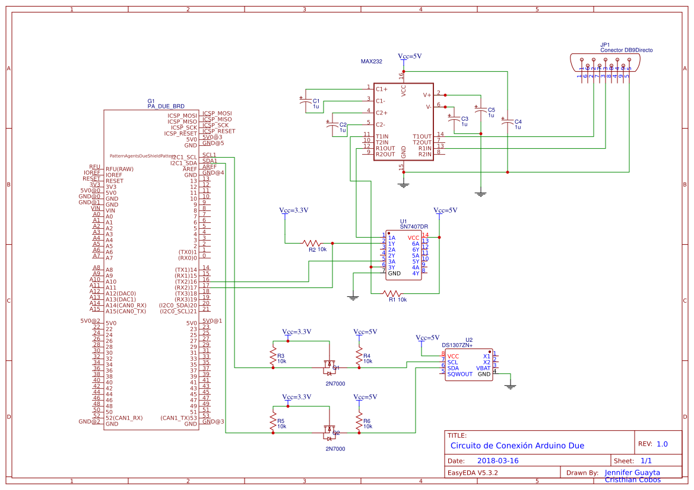

# Arduino-Project

## Arduino for communication between devices and remote control
### Objective
The principal objective of this work was to develop a PCB and program a framework to receive data from device A to device B changing protocol and save the data in a CSV file.

### Hardware
This project uses: 
- Arduino MEGA

 

- MAX485 for  serial protocol 

 

- SD CARD arduino module 

 

- DS1307ZN for real time clock (RTC)

 

In this picture you can see the circuit.

 

### Software
 - First Serial: Received data from Device A with a protocol defined, it was necessary to decode it to get the data. This data was treatment will be saved in a CSV file with date and time.

- Second Serial: Send the data treatment received to device B with another protocol and also receive protocol to activate the relay.

- Third Serial: Is activating to set the parameters for the treatment of the data.
